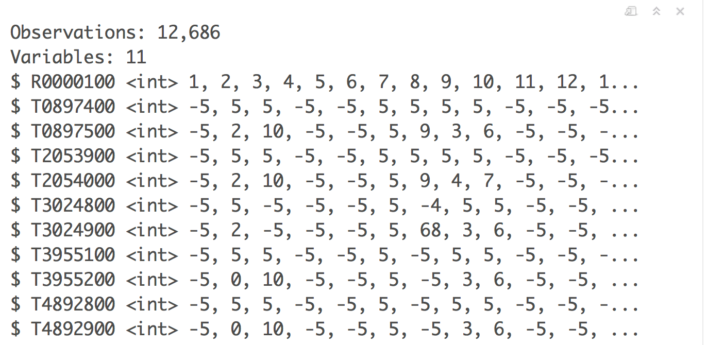
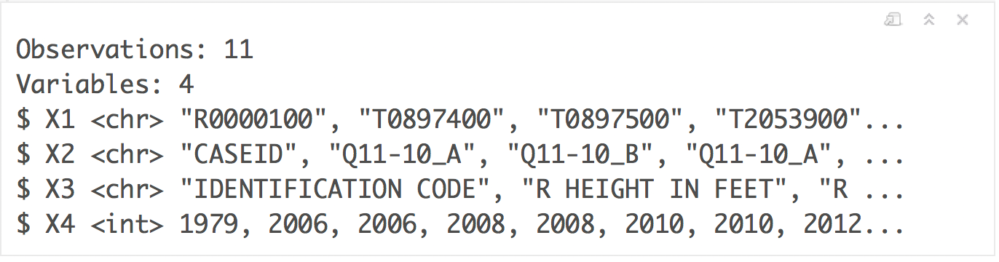

# Introduction

The purpose of this assignment is to tidy and clean the height data for respondents to NLSY '79 for all available years. Tidying the data is necessary because a person's height is recorded with different variables for each survey year. In this form, it is cumbersome, for example, to plot trends in height for individual teens as they aged. For this dataset, "cleaning" the data will refer to identifying values that represent missing values, or values that appear to be erroneously recorded. More on that below.

```{r}
library(tidyverse)
```

# Import and inspect supplied data on height (the early years)

Included with this assignment, is a file named `height_data_early.RData`. Import this data as follows.

```{r}
load("height_data_early.RData")
```

```{r}
glimpse(height_data_early)
```

There are three variables. `CASEID` is an integer code for the individual surveyed. `height` is recorded as a single variable, apparently as inches, perhaps with `NA` values. `year` is an integer. 


# Specific instructions for this project assignment

Your assignment is to use the data in Project1Data.csv and Project1DataHeaders.csv create a tibble named `height_data_late` with the following properties.

1. `height_data_late` has 3 variables with the same names and modes as `height_data_early`. 
2. `height_data_late$CASEID` contains the integer codes for the survey respondents.     
3. `height_data_late$year` contains the year of the data, as an integer.    
4. `height_data_late$height` contains the height of the respondents in inches, as an integer.     
5. Any values indicating missing values of height are represented as `NA` in `height_data_late$height`.   
6. Any values of height data that you judge to not be the true heights of the respondents (outliers) are recorded as `NA` in `height_data_late$height`.    
7. In meeting requirement 6, give an explanation of your reasoning for declaring a value or group of values as an outlier.    

Step by step instructions to carry out these steps are given below.

# 1) Inspect the distributions of variables in early height data

Below, perform the following tasks to gain insight into the distributions of the variables.  This will help guide your work on the remaining height data.

### 1.1 - 2 points
Write the r code to identify the unique years for which data is available in `height_data_early`.  

#### Your work:
```{r}
unique(height_data_early$year[!is.na(height_data_early$height)])

# Explanation = For all heights that are not NA, I take the 
# unique values of their year which comes to 1981,1982,1985. 
```

### 1.2 - 2 points
Restricting data to the first year for which data is available, use the `summary` function to report the quantiles and extreme values of height, and plot a histogram of height, to gain more insight into the distribution. (You will not be graded on your choice of binwidth.)

#### Your work:
```{r}
height_data_early_first_year <- height_data_early %>%
  filter(year == min(year)) %>%
  select(height) %>%
  na.omit(height)

summary(height_data_early_first_year)

hist(as.numeric(unlist(height_data_early_first_year)),
     xlab="height", main="Height Data in first year", col= "red")

# Explanation = I have taken the "height_data_early" data 
# frame. I then filter those rows with year = minimum of 
# that year column. I then only select only height column
# of that resultant data frame. I then omit NA values from 
# that data frame. I then use summary() function to 
# find quantiles and extreme values of height. I then 
# plot histogram of height as below with x axis as "height".

```

## Note on coding of missing values

Within the details on recording of data on the NLSY '79 web site is an explanation of how missing values are coded. For the height variable and others, negative numbers -5 to -1 code for values that are missing for one of 5 reasons. For our purposes, it is better to code all missing values as `NA`, as done in the `height_data_early` dataset.  You will do this in the next section.

# 2) In this step you will import the data we need to complete this project.  Unfortunately, the data is not tidy and you'll need to tidy it up so you can perform your analysis.  You were provided two files:
- Project1Data.csv contains the the height data available for years between 2006 and 2014. 
- Project1DataHeaders.csv contins a table (data dictonary) explaining the meaning of the variables in Project1Data.csv.

To begin, ensure these .csv files are in your "working" directory in Rstudio.

### 2.1 - Import height data into R (5 points)

Import the height data from Project1Data.csv using `readr::read_csv`. This should result in a tibble; called `raw_height_df`. If you use `glimpse` your dataframe should match my version shows the structure reproduced in the following image.  Be sure that all 11 variables listed above are present in your final tibble.



#### Your work:
```{r}
raw_height_df <- readr::read_csv("Project1Data.csv",
                 col_types = cols(.default = "integer"),
                                 show_col_types = FALSE)
glimpse(raw_height_df)

# Explanation = I read the csv file - "Project1Data.csv"
# using the function read_csv() with col_types as default
# integer and store the result in "raw_height_df". I
# use the glimpse() function on "raw_height_df" to match
# the output as shown in the question. 
```

### 2.2 - Import height data dictionary into R (5 points) 
 
Next, import the Project1DataHeaders.csv file, saving the result as a tibble, named, `height_dict`. When I performed this step, I recieved a tibble with the following structure.  Notice that my call to `read_csv` assigned the default column names (X1 to X4), since in my .csv file, no column names were specified.  Provide descriptive column names ("Variable_code", "Q_code", "Description", "year") for `height_dict`.



#### Your work:
```{r}
height_dict <- readr::read_csv("Project1DataHeaders.csv",
        col_names = c("Variable_code", "Q_code", "Description", "year"),
        col_types = cols(.default = "character", year = "integer"),
        show_col_types = FALSE)
glimpse(height_dict)

# Explanation = I read the csv file - "Project1DataHeaders.csv"
# using the function read_csv() with col_names as specified
# above and col_types as default character but year as 
# "integer" and store the result in "height_dict". I
# use the glimpse() function on "height_dict" to match
# the output as shown in the question. 
```


### 2.3 - Clean up coding of missing values in raw_height_df (5 points)
Transform the raw height data so that any value they have represented as missing is coded with an `NA`. Store the updated result back in `raw_height_df`.

#### Your work:
```{r}

raw_height_df <- raw_height_df %>%
                 replace(.<0, NA)

raw_height_df[1:10]

# Explanation = I take the "raw_height_df" data frame. 
# I use replace() function to check all columns 
# less than 0 to be replaced with NA
```


# 3 - Tidy the data

The data dictionary indicates that for these years, the height of an individual was recorded with two variables, one for feet and one for inches. Inspection of a few random rows in `raw_height_df` shows that the feet variables are normally 4, 5, or 6, and the inches variables, are integers between 0 and 11. Also, the height in feet readings are coded with different variables for different years -- this data is untidy.   

To transform the data into the form that matches the early height data we need to 

*  tidy the height in feet variables;    
*  tidy the height in inches variables;     
*  combine these to compute a single height variable;    
*  perform any remaining clean-up of outliers.

### 3.1 - Separate height in feet and height in inches (5 points)

Tidying the data on both feet and inch readings will go most smoothly if we create separate tibbles for each class of measurements. After tidying the data we will re-combine (join) them into a single tibble.   

Use the dictionary to identify the variable codes that correspond to height in feet readings. Create a tibble `raw_ht_feet_df` that contains the data on the height in feet variables and the variable for CASEID (R0000100). Repeat this process to also create `raw_ht_inches_df`.

#### Your work:
```{r}
height_dict_feet <- height_dict[str_detect(height_dict$Description,"FEET$|CODE$"),
                                               "Variable_code"]

raw_ht_feet_df <- raw_height_df[,unlist(height_dict_feet)]
raw_ht_feet_df

height_dict_inches <- height_dict[str_detect(height_dict$Description,"INCHES$|CODE$"),
                                               "Variable_code"]

raw_ht_inches_df <- raw_height_df[,unlist(height_dict_inches)]
raw_ht_inches_df

# Explanation = I create height_dict_feet data frame by selecting
# all rows from height_dict where the description column 
# matches "FEET" or "CODE". The reason I used "CODE" in the 
# regular expression is that I am also looking to include 
# row of R0000100 also in the resultant data frame. The 
# height_dict_feet has one column "Variable_code". I then 
# create raw_ht_feet_df that contains the data on the 
# height in feet variables and the variable for CASEID 
# (R0000100). 
# I create height_dict_inches data frame by selecting
# all rows from height_dict where the description column 
# matches "INCHES" or "CODE". The reason I used "CODE" in the 
# regular expression is that I am also looking to include 
# row of R0000100 also in the resultant data frame. The 
# height_dict_inches has one column "Variable_code". I then 
# create raw_ht_inches_df that contains the data on the 
# height in inches variables and the variable for CASEID 
# (R0000100). 
                  
```


### 3.2 - Tidy the height in feet variables  (5 points) 

We now have a tibble containing exclusively the data on height in feet. Use tidyverse's `gather` to create a tibble, `tidy_height_feet`, with all values of height in feet given in the variable `height_feet`, and the variable codes in the variable `feet_variables`. 

#### Your work:
```{r}
tidy_height_feet <- gather(
  raw_ht_feet_df,
  key = "feet_variables",
  value = "height_feet",
  -one_of("R0000100")
)
tidy_height_feet[1:10,]

# Explanation = I use the gather() function on raw_ht_feet_df that 
# we created in the previous step to create the tibble
# tidy_height_feet which has columns "R0000100", "feet_variables"
# and height_feet". 
```


### 3.3 - Tidy the height in inches data (5 points)

We have a tibble containing exclusively the data on height-inches. Use tidyverse's `gather` to create a tibble, `tidy_height_inches`, with all values of height in inches given in the variable `height_inches`, and the variable codes in the variable `inches_variables`. 

#### Your work:
```{r}
tidy_height_inches <- gather(
  raw_ht_inches_df,
  key = "inches_variables",
  value = "height_inches",
  -one_of("R0000100")
)
tidy_height_inches[1:10,]

# Explanation = I use the gather() function on raw_ht_inches_df 
# that we created in the previous step to create the tibble
# tidy_height_inches which has columns "R0000100",
# "inches_variables" and height_inches". 
```


### 3.4 - Associate height in feet records with a year (5 points)

In `tidy_height_feet`, for each individual there are five records, one corresponding to each variable. Each variable represents height in feet for a particular year. In order to associate height in feet and height in inches readings we need to identify the correct year for each. In this step, use the dictionary tibble to add a variable `year` to `tidy_height_feet`, creating `tidy_height_feet2` that identifies the year corresponding to each variable. Then, remove the `feet_variables` variable from `tidy_height_feet2`. `tidy_height_feet2` should have the columns `R0000100`, `height_feet` and `year`.

#### Your work:
```{r}
tidy_height_feet2 <- merge(tidy_height_feet,height_dict,
                           by.x = "feet_variables",
                           by.y = "Variable_code",
                           all.x = TRUE)

tidy_height_feet2 <- tidy_height_feet2 %>%
                     select("R0000100","height_feet","year")               
tidy_height_feet2[1:10,]

# Explanation = I use the merge() function to merge()
# tidy_height_feet, height_dict and store the result 
# in tidy_height_feet2. I then select only 
# "R0000100","height_feet","year" columns from 
# tidy_height_feet2 to store in tidy_height_feet2.
```


### 3.5 - Associate height in inches records with a year (5 points)

Repeat the preceding work for `tidy_height_inches` to produce `tidy_height_inches2` that has each record associated with an individual and a year. `tidy_height_inches` should also have 3 variables, `R0000100`, `height_inches`, `year`.

#### Your work:
```{r}
tidy_height_inches2 <- merge(tidy_height_inches,height_dict,
                           by.x = "inches_variables",
                           by.y = "Variable_code",
                           all.x = TRUE)

tidy_height_inches2 <- tidy_height_inches2 %>%
                       select("R0000100","height_inches","year")               
tidy_height_inches2[1:10,]

# Explanation = I use the merge() function to merge()
# tidy_height_inches, height_dict and store the result 
# in tidy_height_inches2. I then select only 
# "R0000100","height_inches","year" columns from 
# tidy_height_inches2 to store in tidy_height_inches2.
```


### 3.6 - Join feet and inch data (8 points)

Now, you have tidy data frames for the height-feet readings and the height-inches readings for each individual and each survey year. Join these into a single tibble called `tidy_height_data`. It should have the columns, `R0000100`, `height_feet`, `height_inches`, `year`. 

#### Your work:
```{r}
tidy_height_data <- merge(tidy_height_feet2,tidy_height_inches2,
                           by = c("R0000100","year")) 
tidy_height_data <- tidy_height_data[order(tidy_height_data$R0000100),]
tidy_height_data_col_order = c("R0000100","height_feet","height_inches",
                               "year")
tidy_height_data <- tidy_height_data[,tidy_height_data_col_order]
tidy_height_data[1:10,]

# Explanation = I use merge() function to merge tidy_height_feet2
# and tidy_height_inches2 by "R0000100" and "year". I then order
# the data by "R0000100". I then rearranged the columns 
# accordingly.
```


# 4 - Identify outliers and suspect values

Take a breath and congratulate yourself. Having the data in this tidy form is a big accomplishment. From here it's largely a matter of cleaning up outliers. Also, we need to calculate height from the feet and inches components, but that's simple, if the data doesn't have outliers.

# Explore the height and inch data for unexpected values

Our search for outliers reduces to inspecting the feet and inch variables for unexpected values. We already replaced negative numbers by `NA`. The remaining values are intended to represent real data; we need to judge if they do.

### 4.1 - Inspect values of the height_feet variable (2 points)

For inspecting these variables we don't need to separate by year, but just look for weird values anywhere. For the feet variable, there should only be 3 or 4 non-NA values.

For a detailed inspection, compute and print out all unique values of `height_feet`.

#### Your work:
```{r}
unique(na.omit(tidy_height_data$height_feet))

# Explanation = I take the unique values in height_feet 
# column of tidy_height_data by omitting NA values.

```


### 4.2 - Inspect values of the height_inches variable (2 points)

The `height_inches` variable should have values 0 to 11. As with feet, compute and print out all unique values of the variable.

#### Your work:
```{r}
unique(na.omit(tidy_height_data$height_inches))

# Explanation = I take the unique values in height_inches 
# column of tidy_height_data by omitting NA values.
```


# 5 - Isolation and clean-up of the suspect values

You should have discovered in the preceding sections that there are some values of these variables that don't match our expectations. For some of unexpected values it still may be possible to compute the final height variable. Others, we'll judge to be erroneously recorded, and replace with `NA`. In order to decide that, you should inspect the full records that contain suspect values. 

In this section you should:   

### 5.1 - Define clear criteria (5 points)
Define clear criteria that identify values of `height_feet` and `height_inches` as suspect. Give brief explanations for your decisions, no R code requried.

#### Your work:
Explanation = For height_feet, anything < 4 and > 7 are suspects. For
height_inches, anything > 11 inches are suspects.

### 5.2 - Apply criteria to create two new confident and suspect tibbles (8 points)
Apply your criteria to filter `tidy_height_data` into two new tibbles: `suspect_height_data`, containing the records with suspect values, and `confident_height_data` containing the values that aren't suspect. Include in `confident_height_data` the records for which both `height_feet` and `height_inches` are `NA` (since we are confident we can compute the right value of height for these -- it's `NA`.)

[Important hint: It is difficult to define the right conditions for two `filter` operations that manage to separate every row in `tidy_height_data` into one of two tibbles (`suspect_height_data` or `confident_height_data`). The subtleties are due to combinations of `NA` values. To solve this step, first define  `suspect_height_data`. Then, create `confident_height_data` to consist of every row in `tidy_height_data` not in  `suspect_height_data` by executing the command, 

`confident_height_data <- anti_join(
  tidy_height_data,
  suspect_height_data
  )`
]

Important: To check your work, check that the number of rows in the two tibbles adds up to the number in `tidy_height_data`.

#### Your work:
```{r}
suspect_height_data <- tidy_height_data %>%
                       filter((height_feet %in% c(2,3,8) |
                               height_inches > 11) |
                       (is.na(tidy_height_data$height_feet) & 
                       !is.na(tidy_height_data$height_inches)) |
                       (!is.na(tidy_height_data$height_feet) & 
                         is.na(tidy_height_data$height_inches)))

confident_height_data <- anti_join(
  tidy_height_data,
  suspect_height_data
  )

# Explanation = I take the tidy_height_data data frame and 
# filter values which satisfy the below conditions and store
# in suspect_height_data data frame.
# 1. height_feet equal to 2 or 3 or 8.
# 2. height_inches greater than 11
# 3. Either height_feet or height_inches has NA
# I then use the anti_join() to create "confident_height_data" 
# to consist of every row in "tidy_height_data" not in  
# "suspect_height_data".
```


### 5.3 - Define the height for confident records  (5 points) 

For the records that you are confident are legitimate use the existing variables to add to  `confident_height_data` a new variable, `height`, which represents the full height of a person in inches. Call the new tibble  `height_data_late_part1`. Further transform  `height_data_late_part1` so that the variables are `CASEID`, `year` and `height`, and each are integer vectors, as in `height_data_early`. 


#### Your work:
```{r}
height_data_late_part1 <- confident_height_data %>%
                          mutate(height = height_feet*12 +   
                                          height_inches)
height_data_late_part1 <- height_data_late_part1 %>%
                          rename(CASEID = R0000100) %>%
                          select(CASEID,year,height)

height_data_late_part1$height <- as.integer(height_data_late_part1$height)   
height_data_late_part1[1:10,]

# Explanation = I take the confident_height_data and add a new
# column height by computing height_feet*12 + height_inches,
# I store the result in height_data_late_part1 and then I 
# rename R0000100 as CASEID and select only CASEID,year,height
# columns. I then convert the height variable in 
# height_data_late_part1 as integer. 
                          
```


### 5.4 - Make a decision on suspect records (5 points)

Your selection process should have identified a moderate number of suspect records. Here, I'd like you inspect these records, and identify any for which you believe you can  confidently calculate the height. Write at least 2 criteria for identifying these records and computing the height for these records. Records that do not satisfy these criteria are considered ERRONEOUS. For the latter, the `height` variable will be `NA`.

To carry out this inspection, it's helpful to view the entire `suspect_height_data` tibble. I suggest clicking on this tibble in RStudio's Environment pane to load this into the spreadsheet-like viewer in RStudio's source pane.   

Note: It is not 100% clear what the criteria should be. There is one pattern of values that some may say are suspect and others may believe are legitimate. Just state clearly what your criteria are and your reasoning behind them.

#### Your Work (write down your criteria and provide an explanation, no R code needed):

Criteria 1:  In the suspect_height_data data frame for the column
             height_feet, we can confidently calculate height if the 
             values are 4,5,6,7 and we can replace 2,3,8 values of 
             height_feet with NA as these are considered as 
             ERRONEOUS.
Criteria 2:  In the suspect_height_data data frame for the column
             height_inches, we can confidently calculate height if the 
             values are < 11 and we can replace > 11 values of
             height_inches with NA as these are considered as 
             ERRONEOUS.
etc..


### 5.5 - Act on your criteria to define height for some suspect records (5 points) 

Your goal for this step is to create the tibble  `height_data_late_part2`, which has the same variables as `height_data_late_part1`, with `height` defined, possibly as `NA`, for each record in `suspect_height_data`.  

To carry this out, further filter `suspect_height_data` into separate tibbles containing the records satisfying each of the criteria defined above for determining the height.  Name each tibble df1, df2, etc, to coorispond with your criteria.  Apply your criteria to each tibble to define height for these records. After you also select and rename the variables in the tibbles to match those desired, create a tibble `height_data_late_part2` containing all records in one of the new tibbles.  To carry out this last step, use the `bind_rows` function.
[To combine tibbles `df1` and `df2` with `bind_rows`, execute `bind_rows(df1, df2)`.]

#### Your work:
```{r}
height_data_late_part2 <- height_data_late_part1 
height_data_late_part2$height[
which(height_data_late_part2$CASEID 
%in% unlist(suspect_height_data$R0000100))]<- NA


suspect_height_data_feet_df <- suspect_height_data %>%                    
                               select(R0000100,year,height_feet) 
        
suspect_height_data_feet_df$height_feet <-  
ifelse(suspect_height_data_feet_df$height_feet              
%in% c(2,3,8),NA,suspect_height_data_feet_df$height_feet)
  
suspect_height_data_inches_df <- suspect_height_data %>%
                                 select(R0000100,year,height_inches) 

suspect_height_data_inches_df$height_inches <-  
ifelse(suspect_height_data_inches_df$height_inches > 11,NA,
suspect_height_data_inches_df$height_inches)

height_data_late_part2 <- merge(suspect_height_data_feet_df,
                 suspect_height_data_inches_df,
                 by = c("R0000100","year"))

height_data_late_part2[1:10,]

# Explanation = I create height_data_late_part2 from 
# height_data_late_part1 and then make all height values 
# NA if it satisfies the condition that the CASEID in 
# height_data_late_part2 matches R0000100 column values
# in suspect_height_data. I then select columns R0000100,
# year,height_feet from suspect_height_data to form a 
# new data frame suspect_height_data_feet_df. 
# Then I check if the height_feet column of 
# suspect_height_data_feet_df is matching any of 2,3,8
# then I make those values NA.
# I then select columns R0000100,
# year,height_inches from suspect_height_data to form a 
# new data frame suspect_height_data_inches_df. 
# Then I check if the height_feet column of 
# suspect_height_data_inches_df is matching any value > 11
# then I make those values NA.
# I then merge suspect_height_data_feet_df and 
# suspect_height_data_inches_df by "R0000100","year" columns
# and store the values in height_data_late_part2 data frame.

```


### 5.6 - Combine the two parts of the late height data  (5 points)

You defined height data for two classes of records, giving `height_data_late_part1` and `height_data_late_part2`. Bind these different tibbles into the single tibble, `height_data_late`. Check that `height_data_late` has the desired variables, variable names and variable modes.

#### Your work:
```{r}
height_data_late_part2 <- height_data_late_part2 %>%
                          mutate(height = height_feet*12 +   
                                          height_inches) %>%
                          select(R0000100,year,height) %>%
                          rename(CASEID = R0000100)
height_data_late <- rbind(height_data_late_part1, height_data_late_part2)
height_data_late_col_order = c("CASEID","height","year")
height_data_late <- height_data_late[,height_data_late_col_order]
height_data_late$height <- as.integer(height_data_late$height)
height_data_late[1:10,]

# Explanation = I take the data frame height_data_late_part2
# create a new column height by calculating height_feet*12 
# + height_inches. I then select columns R0000100,year,height
# I then rename R0000100 with CASEID. Using rbind() I combine
# rows of height_data_late_part1 and height_data_late_part2
# and form a new data frame height_data_late. I change the 
# order of the columns accordingly. I then change the 
# height column to integer. 

```


# 6.1 - Explore the final heights (8 points)

The last year of the survey is 2014. Plot a histogram of the height data you computed for 2014, with binwidth of your choice.  The histogram should be similar to the one you plotted for the early data. 

### Your work:
```{r}
ggplot(
  data = filter(height_data_late,
                year == 2014),
  aes(x = height)
) + 
  geom_histogram(color = "black", fill = "red",binwidth = 2) + 
  scale_x_continuous(
     name = "height",
     breaks = seq(0,80,5),
     labels = seq(0,80,5)) +
  scale_y_continuous(
     name = "Frequency",
     breaks = seq(0,3000,500),
     labels = seq(0,3000,500))

# Explanation = With ggplot() to plot a histogram, I take the 
# height_data_late data frame and filter the rows based on 
# year = 2014. I give the bin width as 2. Using the 
# scale_x_continuous and scale_y_continuous
# I give labels to the x and y axis and breaks. 

```


# 7.1 - Save your tibble to the work directory (3 points)

Execute `save(height_data_late, file = "height_data_late.RData")` in a code chunk to save your final answer.

### Your work:
```{r}
save(height_data_late, file = 
"C:\\Users\\Account\\Documents\\R\\Project-A\\height_data_late.RData")

# Explanation = Finally, I store the height_data_late data 
# frame as a file in the working directory as
# height_data_late.RData
```


# SUBMIT

When you are ready, click submit! 
